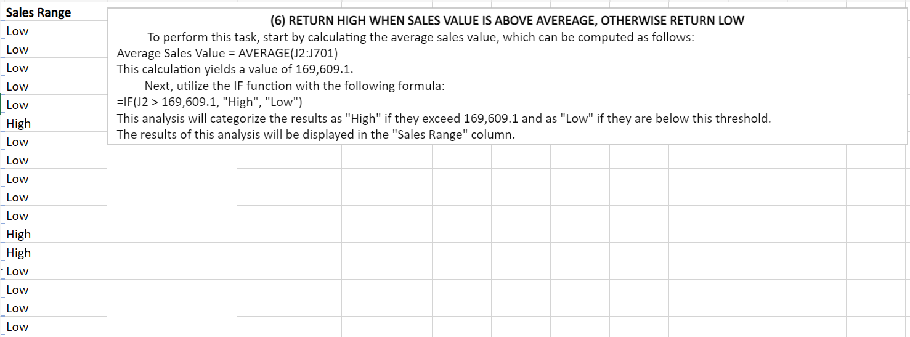

# Sales Data Analysis

## INTRODUCTION
This is an Excel task focused on analyzing a robust sales dataset comprising 700 rows and 13 columns. Our goal is to extract key insights by addressing various questions related to total revenue, profit, and average sales metrics. Leveraging the power of data analytics, we aim to provide a detailed understanding of the extensive sales landscape, identifying patterns and deriving actionable conclusions. Throughout this exploration, we'll make sense of the sales data, assess the performance of different products and segments, and answer critical questions about high-selling regions and well-performing products in specific areas. Let's collaboratively dive into the 700 rows and 13 columns of information to uncover valuable insights about our sales performance.

## PROBLEM STATEMENT
In the realm of sales data analysis, a pressing challenge emerges as we endeavor to derive comprehensive insights from the provided dataset. The scope of this task involves determining fundamental metrics such as:
1. Total revenue and profit generated
2. Average revenue and units sold for every order
3. Total discounts
4. Total number of sales recorded and Highest profit achieved
5. Creating a'**Sales Range**' column to return '**high**' if the sales value is above average otherwise '**low**'
6.  Average revenue from 'Paseo' sales
7. The count of sales in the Government and Midmarket segments
8. The total revenue from 'Montana' sales in Canada
9. The country, segment, and month where the highest units of goods were sold
10. The total profit specifically made in the month of December.

## SKILLS AND CONCEPTS DEMOSTRATED
1. Basic Functions in Excel such as:
   - Sum
   - Average
   - Count
   - If
   - Max
2. Advanced Functions in Excel such as:
   - Xlookup
   - Sumif and Sumifs
   - Averageif and Averageifs
   - Countif and Countifs

## ANALYSIS, RESULTS AND DISCUSSIONS

### 1. Total Revenue and Profit Generated
The total revenue is calculated by summing the values in the Gross-sales column, represented by column letter J, spanning from row numbers 2 to 701. The function used is SUM(J2:J701), yielding a total revenue of $127,931,598.50.
Similarly, the total profit is determined in the same manner, utilizing the profit column as letter K and row numbers ranging from 2 to 701. The function employed is SUM(K2:K701), resulting in a total profit of $168,937,02.3.
Hence the computed results are as follows:
- Total revenue: $127,931,598.50
- Total profit: $168,937,02.3

### 2. Average Revenue and Units Sold for Every Order
The average revenue is determined by adding up the values in the Gross-sales column, denoted by column J, and then dividing the result by the total number of rows, which is 700. The function applied is Average(J2:J701), resulting in an average revenue of $182,759.40.
Likewise, the average units sold per order is calculated in a similar manner to the average revenue, utilizing the units sold column with letter E and considering the total number of rows as 700. The function employed is Average(E2:E701), yielding an average units sold of $1,608.30.
Hence the computed results are as follows:
- Average revenue: $182,759.40
- Average Units sold: $1,608.30

### 3. Total Discounts
The total discounts offered throughout the sales period are calculated by adding up the values in the discount column, denoted by the column letter I, ranging from row numbers 2 to 701. The function applied is SUM(I2:I701), resulting in a total discount of $9,205,248.24.

### 4. Total Number of Sales Recorded and Highest Profit Achieved
The total number of sales recorded is established by counting the occurrences of Gross-sales, using the Gross-sales column indicated by the letter J, ranging from row 2 to 701. The function employed is COUNT(J2:J701), resulting in a total number of 700 sales recorded.
Simultaneously, the determination of the maximum profit achieved involves applying the Max function to the profit column identified by column letter K, ranging from row numbers 2 to 701. The function used is MAX(K2:K701), yielding $262,200.00 as the highest profit generated during the sales period.
Thus, the computed results are as follows:
- Total number of sales: 700
- Highest profit: $262,200.00

### 5. Creating a '**Sales Range**' Column to Return '**High**' if the Sales Value is above Average Otherwise '**Low**'
To address this question, begin by establishing a new column named 'Sales Range,' denoted by column M. Next, calculate the average sales using the sales column denoted by column H, ranging from row numbers 2 to 701. The function utilized is AVERAGE(H2:H701), yielding an average sales value of $169,609.1. Lastly, apply the IF function in cell M2 to return 'High' when H2 is greater than $169,609.1; otherwise, it should return 'Low'. Subsequently, leverage flash fill to use the function applied in cell M2 and compute results for other cells within the sales range column.

