# Sales Data Analysis

## INTRODUCTION
This is an Excel task focused on analyzing a robust sales dataset comprising 700 rows and 13 columns. Our goal is to extract key insights by addressing various questions related to total revenue, profit, and average sales metrics. Leveraging the power of data analytics, we aim to provide a detailed understanding of the extensive sales landscape, identifying patterns and deriving actionable conclusions. Throughout this exploration, we'll make sense of the sales data, assess the performance of different products and segments, and answer critical questions about high-selling regions and well-performing products in specific areas. Let's collaboratively dive into the 700 rows and 13 columns of information to uncover valuable insights about our sales performance.

## PROBLEM STATEMENT
In the realm of sales data analysis, a pressing challenge emerges as we endeavor to derive comprehensive insights from the provided dataset. The scope of this task involves determining fundamental metrics such as:
1. Total revenue and profit generated
2. Average revenue and units sold for every order
3. Total discounts
4. Total number of sales recorded and Highest profit achieved
5. Creating a'**Sales Range**' column to return '**high**' if the sales value is above average otherwise '**low**'
6.  Average revenue Per 'Paseo' sales
7. The count of sales in the Government and Midmarket segments
8. The total revenue from 'Montana' sales in Canada
9. The country, segment, and month where the highest units of goods were sold
10. The total profit specifically made in the month of December.

## SKILLS AND CONCEPTS DEMOSTRATED
1. Basic Functions in Excel such as:
   - Sum
   - Average
   - Count
   - If
   - Max
2. Advanced Functions in Excel such as:
   - Vlookup
   - Sumif and Sumifs
   - Averageif and Averageifs
   - Countif and Countifs

## ANALYSIS, RESULTS AND DISCUSSIONS

### 1. Total Revenue and Profit Generated

The total revenue is calculated by summing the values in the Gross-sales column, represented by column letter J, spanning from row numbers 2 to 701. The function used is: =SUM(J2:J701), yielding a total revenue of $127,931,598.50.
Similarly, the total profit is determined in the same manner, utilizing the profit column as letter K and row numbers ranging from 2 to 701. The function employed is: =SUM(K2:K701), resulting in a total profit of $168,937,02.3.
Hence the computed results are as follows:
- Total revenue: $127,931,598.50
- Total profit: $168,937,02.3

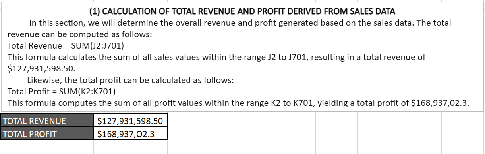

### 2. Average Revenue and Units Sold for Every Order

The average revenue is determined by adding up the values in the Gross-sales column, denoted by column J, and then dividing the result by the total number of rows, which is 700. The function applied is: =Average(J2:J701), resulting in an average revenue of $182,759.40.
Likewise, the average units sold per order is calculated in a similar manner to the average revenue, utilizing the units sold column with letter E and considering the total number of rows as 700. The function employed is: =Average(E2:E701), yielding an average units sold of $1,608.30.
Hence the computed results are as follows:
- Average revenue: $182,759.40
- Average Units sold: $1,608.30

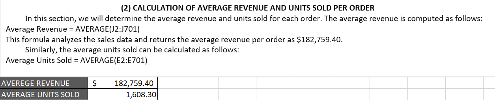

### 3. Total Discounts

The total discounts offered throughout the sales period are calculated by adding up the values in the discount column, denoted by the column letter I, ranging from row numbers 2 to 701. The function applied is: =SUM(I2:I701), resulting in a total discount of $9,205,248.24.

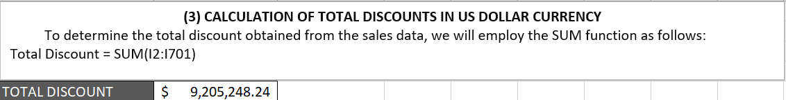

### 4. Total Number of Sales Recorded and Highest Profit Achieved

The total number of sales recorded is established by counting the occurrences of Gross-sales, using the Gross-sales column indicated by the letter J, ranging from row 2 to 701. The function employed is: =COUNT(J2:J701), resulting in a total number of 700 sales recorded.
Simultaneously, the determination of the maximum profit achieved involves applying the Max function to the profit column identified by column letter K, ranging from row numbers 2 to 701. The function used is: =MAX(K2:K701), yielding $262,200.00 as the highest profit generated during the sales period.
Thus, the computed results are as follows:
- Total number of sales: 700
- Highest profit: $262,200.00

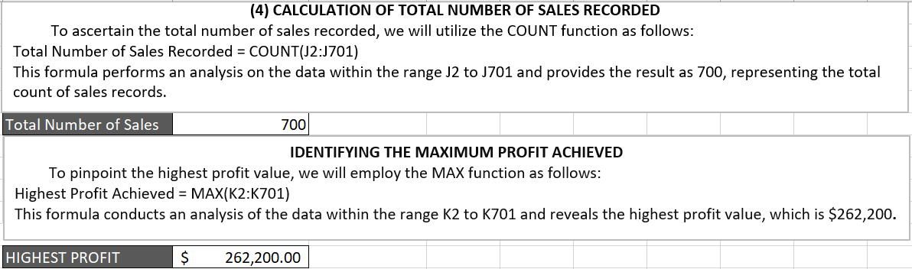

### 5. Creating a '**Sales Range**' Column to Return '**High**' if the Sales Value is above Average Otherwise '**Low**'

To address this question, begin by establishing a new column named 'Sales Range,' denoted by column M. Next, calculate the average sales using the sales column denoted by column H, ranging from row numbers 2 to 701. The function utilized is: =AVERAGE(H2:H701), yielding an average sales value of $169,609.1. Lastly, apply the IF function in cell M2 to return 'High' when H2 is greater than $169,609.1; otherwise, it should return 'Low'. Subsequently, leverage flash fill to use the function applied in cell M2 and compute results for other cells within the sales range column.

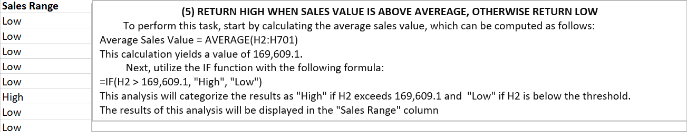

### 6. Average Revenue Per 'Paseo' Sales

The calculation of the average revenue per Paseo sale involves the utilization of the AVERAGEIF function. In this context, we consider two columns: the product column, denoted as column C and spanning from 2 to 701, and the Gross-sales column, denoted as column J and ranging from 2 to 701. The function employed is: =AVERAGEIF(C2:C701, "Paseo", J2:J701). This function analyzes the product column, and where the product "Paseo" is identified, it computes the average based on the Gross-sales column, resulting in an average revenue per Paseo sale of $163,421.50.

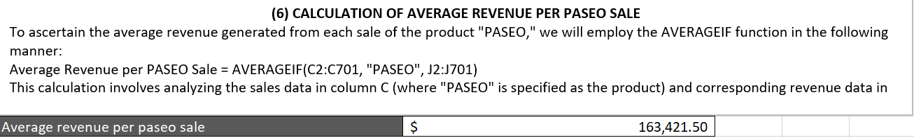

### 7. The Count of Sales in the Government and Midmarket Segments

The count of sales in both the government and midmarket segments is determined using the COUNTIF function. In this scenario, the segment column denoted by column A, ranging from 2 to 701, is considered. The function is applied separately for each segment, specifying "Government" and "Midmarket." The computations are as follows:
- =COUNTIF(A2:A701, "Government"), resulting to 300 sales in the government segment.
- =COUNTIF(A2:A701, "Midmarket"), resulting to 100 sales in the midmarket segment.
 This totals to 400 sales in both the government and midmarket segments.

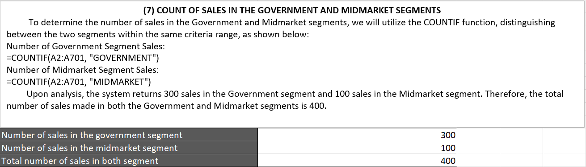

### 8. The Total Revenue from 'Montana' Sales in Canada

To calculate the total revenue from Montana sales in Canada, the SUMIFS function is employed, considering two conditions: a specific product sold in a particular country. The relevant columns are the Product column denoted as C, the Country column denoted as B, and the Gross-sales column denoted as J, all spanning from row number 2 to 701.
The applied function is: =SUMIFS(J2:J701, B2:B701, "Canada", C2:C701, "Montana"). In this function, J2:J701 is the sum range, B2:B701 is the first criteria range where "Canada" is located, and C2:C701 is the second criteria range where "Montana" is located. This yields the result of the total revenue from Montana sales in Canada as $2,711,919.03.

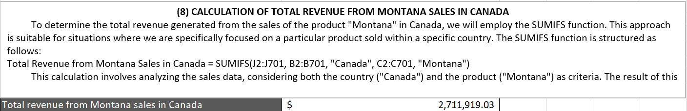

### 9. The country, segment, and month where the highest units of goods were sold

To determine the country, segment, and month where the highest units of goods were sold, we will calculate them individually using the VLOOKUP function. VLOOKUP searches for a value in the leftmost column and returns a related value from a specified column. It's essential to arrange the corresponding columns for country, segment, and months in front of the lookup column where the lookup value is found.

The VLOOKUP syntax involves four arguments and is written as: =VLOOKUP(Lookup-value, table-array, column-index-number, range-lookup). Here, the lookup value is the highest units sold (4492.5), the table-array is the range of cells from the corresponding column down to the lookup column, the column-index-number is the number of the column where the corresponding value is found within the table array, and the range-lookup is set to false by default, meaning it should return false if the exact value we are looking up is not found.

The function is applied as follows to determine the country, segment, and month with the highest units of goods sold, respectively:
- Country: =VLOOKUP(4492.5, A2:C701, 3, False), resulting as the United States of America.
- Segment: =VLOOKUP(4492.5, A2:B701, 2, False), resulting as Government.
- Month: =VLOOKUP(4492.5, A2:D701, 4, False), resulting as April.

Therefore, the country in the government segment with the highest units of goods sold in the month of April is the United States of America.

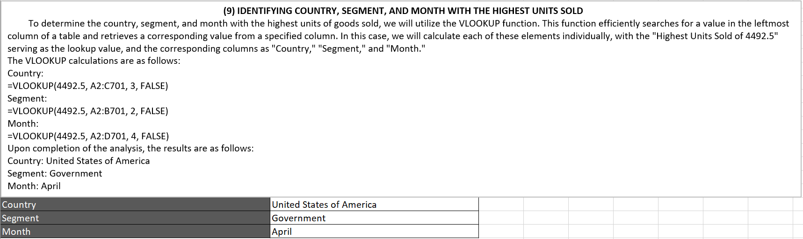

### 10. The Total Profit Specifically Made in the Month of December

To calculate the total profit made in the month of December, we will use the SUMIF function, considering the month column denoted as column D and the profit column denoted as column K, both ranging from row number 2 to 701. The applied function is: =SUMIF(D2:D701, "December", K2:K701). This function examines the month column and, wherever "December" is found, it sums up the corresponding profits, resulting in a total profit made in the month of December as: $2,717,330.00.

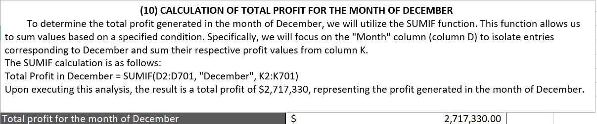

## RECOMMENDATIONS

Based on the analysis conducted in the sales data task, it is recommended to focus on optimizing sales strategies in specific segments. The insights gained, such as identifying country, segments, and months with the highest units sold, can inform targeted marketing and sales efforts. Utilizing the 'Sales Range' classification can help tailor approaches for products performing above or below the average, enhancing efficiency in resource allocation.
Furthermore, considering the success in analyzing specific-product performance, there's an opportunity to explore similar detailed analyses for other products in the dataset. This approach can uncover trends and patterns that may guide product development and marketing campaigns.

## CONCLUSIONS

In conclusion, the sales taak has provided valuable insights into revenue generation, profit margins, and product performance. The thorough analysis of segments, products, country and months has equipped the organization with actionable information to refine and optimize sales strategies.
The task shows the significance of leveraging data analytics tool and functions in Excel to derive meaningful conclusions. By translating data into actionable insights, the organization is better positioned to make informed decisions that drive sales growth and improve overall business performance.

In summary, the results of all calculations are presented below:

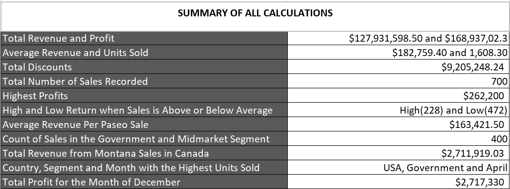

